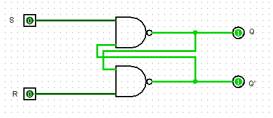
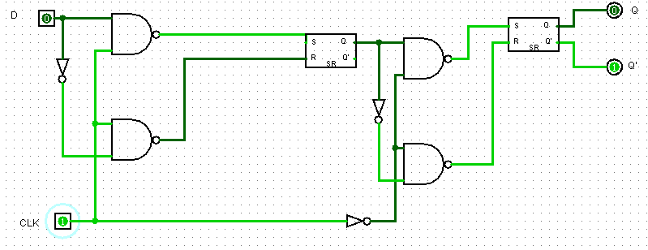
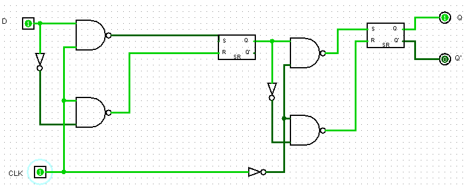
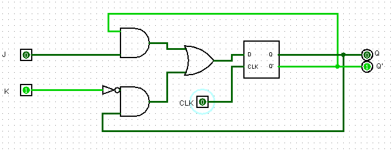
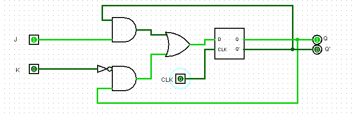
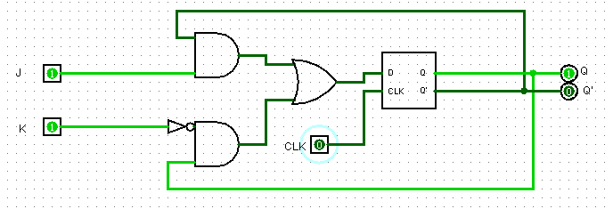

# Relatório Técnico de Circuitos Digitais

## Componente: Registrador Flip-Flop do Tipo D e do Tipo JK

---

### 1. Descrição do Componente

- *Descrição Geral:*  
  Os registradores Flip-Flop são usados para armazenar um único bit de informação. Eles operam de acordo com os sinais de entrada e são sincronizados pelo pulso de clock. Os Flip-Flops JK e D tem sua origem atrelada a busca por solucionar limitações e comportamentos indesejados do Flip-Flop RS, como por exemplo o estado proíbido R = 1 / S = 1. O Flip-Flop do tipo *D* (Data Flip-Flop) transfere o valor da entrada \(D\) para a saída \(Q\) no pulso do clock. O Flip-Flop do tipo *JK* é mais versátil, permitindo as operações de *Set*, *Reset*, e *alternância do estado \(comutação\)* dependendo das entradas \(J\) e \(K\).

- *Pinos e Lógica do Componente:*

  #### Flip-Flop Tipo D:
  | Pino | Nome/Função   | Descrição                                         |
  |------|---------------|--------------------------------------------------|
  | 1    | Entrada D     | Entrada de dados. Valor a ser armazenado.         |
  | 2    | Clock (CLK)   | Pulso de sincronização do Flip-Flop.              |
  | 3    | Q             | Saída do estado armazenado (1 ou 0).              |
  | 4    | Q'            | Saída complementar de \(Q\).                      |
  
  

  #### Flip-Flop Tipo JK:
  | Pino | Nome/Função   | Descrição                                         |
  |------|---------------|--------------------------------------------------|
  | 1    | Entrada J     | Entrada de controle para setar \( J = 1, K = 0 \). |
  | 2    | Entrada K     | Entrada de controle para resetar \( J = 0, K = 1 \). |
  | 3    | Clock (CLK)   | Pulso de sincronização do Flip-Flop.              |
  | 4    | Q             | Saída do estado armazenado (1 ou 0).              |
  | 5    | Q'            | Saída complementar de \(Q\).                      |
  

- *Função Lógica:*  
  #### Flip-Flop Tipo D:
  - Quando ocorre um pulso no clock \(CLK\):
    - \( Q = D \)
    - \( Q' = ~D \)

  #### Flip-Flop Tipo JK:
  - Quando ocorre um pulso no clock \(CLK\):
    - \( J = 0, K = 0 \): Sem alteração no estado.
    - \( J = 0, K = 1 \): \( Q = 0 \) (Reset).
    - \( J = 1, K = 0 \): \( Q = 1 \) (Set).
    - \( J = 1, K = 1 \): \( Q = ~Q \) (Comuta).

---

### 2. Esquema do Circuito

- *Captura de Tela do Circuito em Logisim:*

  - Flip-Flop RS:
  
    
  Legenda: O esquema mostra os Flip-Flops tipo RS com as entradas \(R\), \(S\) e o pulso de clock conectados aos controles.

- *Descrição do Esquema Flip-Flop RS:*
  
  Esse circuito apresenta o Flip-Flop mais básico, com duas portas NAND e entradas R para reset e S para set.

  - Flip-Flop D:
  
    
  Legenda: O esquema mostra os Flip-Flops tipo D com entrada \(D\) e o pulso de clock conectados aos controles.

- *Descrição do Esquema Flip-Flop D:*
  
  Esse circuito é composto por portas lógicas, um bloco RS, uma entrada D e inclui um sinal de clock \(CLK\). Pode ser considerado uma evolução, uma vez que simplifica o funcionamento do Fli-Flop RS reduzindo o número de entradas, assim eliminando o risco de ocorrer o estado proíbido. 
  
  - Flip-Flop JK:

    
  Legenda: O esquema mostra os Flip-Flops tipo D e tipo JK, com as entradas \( J \), \( K \), e o pulso de clock conectados aos controles.

- *Descrição do Esquema Flip-Flop JK:*
  
  Assim como o Flip-Flop D, este circuito também é uma evolução do Flip-Flop RS. Possui duas entradas \(J\) e \(K\) que permite maior controle e evita o estado proíbido.  
  

---

### 3. Testes Realizados

#### Configuração do Teste

- *Descrição do Teste:*  
  Testamos o comportamento dos Flip-Flops \(D\) e \(JK\) sob diferentes condições de entrada e sinais de clock para validar o armazenamento e as alterações de estado.

- *Entradas, Conexões e Saídas Esperadas:*  

  #### Flip-Flop Tipo D:
   | Entrada D | Clock (CLK) | Q Obtido | Q' Obtido |
  |-----------|--------------|----------|----------|
  | 0         | 1            | 0        | 1        |
  | 1         | 1            | 1        | 0        |
  

  #### Flip-Flop Tipo JK:
  | Entrada J | Entrada K | Clock (CLK) | Q Esperado | Q' Esperado |
  |-----------|-----------|-------------|------------|------------|
  | 0         | 0         | 1           | Sem Alteração | Sem Alteração |
  | 0         | 1         | 1           | 0          | 1          |
  | 1         | 0         | 1           | 1          | 0          |
  | 1         | 1         | 1           | Comuta     | Comuta     |

#### Configuração do Logisim

- *Configurações Utilizadas:*  
  - Entradas conectadas a portas lógicas AND e NAND.  
  - Saídas \(Q\) e \(Q'\) 

---

### 4. Resultados dos Testes

- *Resultados Obtidos no Logisim:*  

  #### Flip-Flop Tipo D:
  | Entrada D | Clock (CLK)  | Q Obtido | Q' Obtido |
  |-----------|--------------|----------|----------|
  | 0         | 1            | 0        | 1        |
  | 1         | 1            | 1        | 0        |
 

  #### Flip-Flop Tipo JK:
  | Entrada J | Entrada K | Clock (CLK) | Q Obtido | Q' Obtido |
  |-----------|-----------|-------------|----------|----------|
  | 0         | 0         | 1           | Sem Alteração | Sem Alteração |
  | 0         | 1         | 1           | 0        | 1        |
  | 1         | 0         | 1           | 1        | 0        |
  | 1         | 1         | 1           | Comuta   | Comuta   |

- *Flip-Flop D Captura dos Resultados:*
  
    
  Legenda: Primeiro teste realizado D = 0.
  
    
  Legenda: Segundo teste realizado D = 1.
  
- *Flip-Flop JK Captura dos Resultados:*

    
  Legenda: Primeiro teste realizado J = 0 / K = 1.
  
    
  Legenda: Segundo teste realizado J = 1 / K = 0.
  
    
  Legenda: Terceiro teste realizado J = 1 / K = 1.
  
- *Análise dos Resultados:*  
  Os testes confirmaram o comportamento esperado dos Flip-Flops \(D\) e \(JK\). O Flip-Flop tipo \(D\) transferiu corretamente o valor da entrada \(D\) para \(Q\). O Flip-Flop tipo \(JK\) apresentou as transições de estado conforme esperado para cada combinação de entradas \(J\) e \(K\).

---

Relatório elaborado por: **Ranier Sales e Luccas Henrique**  
Última atualização: **09/12/2024**
