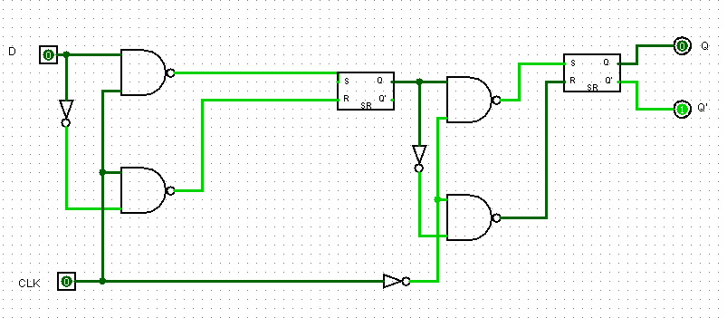
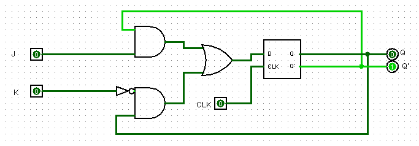

# Relatório Técnico de Circuitos Digitais

## Componente: Registrador Flip-Flop do Tipo D e do Tipo JK

---

### 1. Descrição do Componente

- *Descrição Geral:*  
  Os registradores Flip-Flop são componentes fundamentais em circuitos digitais, usados para armazenar um único bit de informação. Eles operam de acordo com os sinais de entrada e são sincronizados pelo pulso de clock.  
  - O Flip-Flop do tipo *D* (Data Flip-Flop) transfere o valor da entrada \( D \) para a saída \( Q \) no pulso do clock.  
  - O Flip-Flop do tipo *JK* é mais versátil, permitindo as operações de *Set, **Reset*, e alternância do estado (\( Toggle \)) dependendo das entradas \( J \) e \( K \).

- *Pinos e Lógica do Componente:*

  #### Flip-Flop Tipo D:
  | Pino | Nome/Função   | Descrição                                         |
  |------|---------------|--------------------------------------------------|
  | 1    | Entrada D     | Entrada de dados. Valor a ser armazenado.         |
  | 2    | Clock (CLK)   | Pulso de sincronização do Flip-Flop.              |
  | 3    | Q             | Saída do estado armazenado (1 ou 0).              |
  | 4    | Q'            | Saída complementar de \( Q \).                   |
  | 5    | Reset         | Reinicia o estado para 0.                        |
  

  #### Flip-Flop Tipo JK:
  | Pino | Nome/Função   | Descrição                                         |
  |------|---------------|--------------------------------------------------|
  | 1    | Entrada J     | Entrada de controle para setar (\( J = 1, K = 0 \)). |
  | 2    | Entrada K     | Entrada de controle para resetar (\( J = 0, K = 1 \)). |
  | 3    | Clock (CLK)   | Pulso de sincronização do Flip-Flop.              |
  | 4    | Q             | Saída do estado armazenado (1 ou 0).              |
  | 5    | Q'            | Saída complementar de \( Q \).                   |
  

- *Função Lógica:*  
  #### Flip-Flop Tipo D:
  - Quando ocorre um pulso no clock (\( CLK \)):
    - \( Q = D \)
    - \( Q' = \neg D \)

  #### Flip-Flop Tipo JK:
  - Quando ocorre um pulso no clock (\( CLK \)):
    - \( J = 0, K = 0 \): Sem alteração no estado.
    - \( J = 0, K = 1 \): \( Q = 0 \) (Reset).
    - \( J = 1, K = 0 \): \( Q = 1 \) (Set).
    - \( J = 1, K = 1 \): \( Q = \neg Q \) (Toggle).

---

### 2. Esquema do Circuito

- *Captura de Tela do Circuito em Logisim:*
  
    
  Legenda: O esquema mostra os Flip-Flops tipo D e tipo JK, com as entradas \( D \), \( J \), \( K \), e o pulso de clock conectados aos controles.
  
    
  Legenda: O esquema mostra os Flip-Flops tipo D e tipo JK, com as entradas \( D \), \( J \), \( K \), e o pulso de clock conectados aos controles.

- *Descrição do Esquema:*  
  O circuito foi montado no Logisim utilizando componentes Flip-Flop nativos. Entradas e saídas foram conectadas a Switches e Probes para simulação, com as saídas \( Q \) e \( Q' \) monitoradas.

---

### 3. Testes Realizados

#### Configuração do Teste

- *Descrição do Teste:*  
  Testamos o comportamento dos Flip-Flops \( D \) e \( JK \) sob diferentes condições de entrada e sinais de clock para validar o armazenamento e as alterações de estado.

- *Entradas, Conexões e Saídas Esperadas:*  

  #### Flip-Flop Tipo D:
  | Entrada D | Clock (CLK) | Reset | Q Esperado | Q' Esperado |
  |-----------|-------------|-------|------------|------------|
  | 0         | 1           | 0     | 0          | 1          |
  | 1         | 1           | 0     | 1          | 0          |
  | X         | X           | 1     | 0          | 1          |

  #### Flip-Flop Tipo JK:
  | Entrada J | Entrada K | Clock (CLK) | Q Esperado | Q' Esperado |
  |-----------|-----------|-------------|------------|------------|
  | 0         | 0         | 1           | Sem Alteração | Sem Alteração |
  | 0         | 1         | 1           | 0          | 1          |
  | 1         | 0         | 1           | 1          | 0          |
  | 1         | 1         | 1           | Toggle     | Toggle     |

#### Configuração do Logisim

- *Configurações Utilizadas:*  
  - Entradas conectadas a Switches.  
  - Clock conectado a um gerador de pulsos.  
  - Saídas \( Q \) e \( Q' \) conectadas a Probes.  

---

### 4. Resultados dos Testes

- *Resultados Obtidos no Logisim:*  

  #### Flip-Flop Tipo D:
  | Entrada D | Clock (CLK) | Reset | Q Obtido | Q' Obtido |
  |-----------|-------------|-------|----------|----------|
  | 0         | 1           | 0     | 0        | 1        |
  | 1         | 1           | 0     | 1        | 0        |
  | X         | X           | 1     | 0        | 1        |

  #### Flip-Flop Tipo JK:
  | Entrada J | Entrada K | Clock (CLK) | Q Obtido | Q' Obtido |
  |-----------|-----------|-------------|----------|----------|
  | 0         | 0         | 1           | Sem Alteração | Sem Alteração |
  | 0         | 1         | 1           | 0        | 1        |
  | 1         | 0         | 1           | 1        | 0        |
  | 1         | 1         | 1           | Toggle   | Toggle   |

- *Captura de Tela do Resultado:*  
    
  Legenda: As capturas de tela mostram os resultados esperados e obtidos para cada condição testada.

- *Análise dos Resultados:*  
  Os testes confirmaram o comportamento esperado dos Flip-Flops \( D \) e \( JK \). O Flip-Flop tipo \( D \) transferiu corretamente o valor da entrada \( D \) para \( Q \). O Flip-Flop tipo \( JK \) apresentou as transições de estado conforme esperado para cada combinação de entradas \( J \) e \( K \).

---

Relatório elaborado por: [Seu Nome/Equipe]  
Última atualização: [Data]
