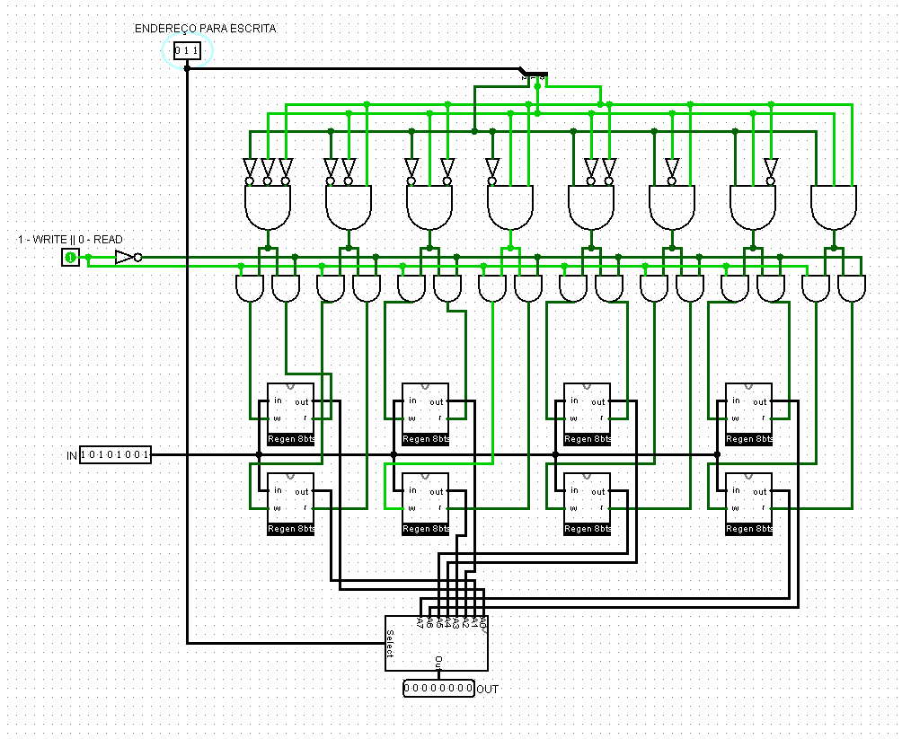
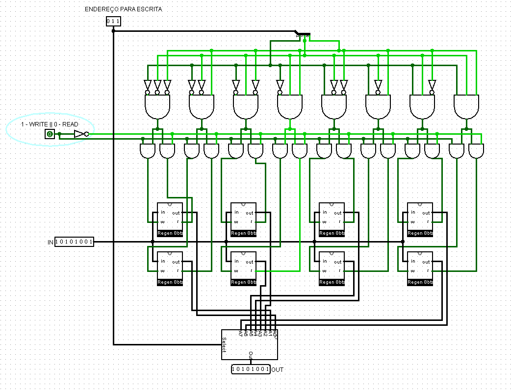

# **Relatório Técnico de Circuitos Digitais**

## **Componente: Memória RAM com Registradores e Multiplexadores**

---

### **1. Descrição do Componente**

- **Descrição Geral:**
  Este componente é uma memória RAM funcional composta por 8 registradores de 8 bits cada. Ele permite realizar operações de leitura e escrita de dados utilizando sinais de controle e endereçamento. Um multiplexador 8x1 é utilizado para selecionar qual registrador será lido. A escrita em um registrador é controlada por um demultiplexador derivado do sinal de controle e do endereço fornecido.

- **Pinos e Lógica do Componente:**
  | Pino                  | Nome/Função               | Descrição                                             |
  |-----------------------|---------------------------|-----------------------------------------------------|
  | Entrada \(D[7:0]\)    | Dados                    | Entrada dos dados a serem escritos.                |
  | Entrada \(WRITE\)     | Sinal de Escrita         | Habilita a escrita no registrador selecionado.     |
  | Entrada \(READ\)      | Sinal de Leitura         | Habilita a leitura do registrador selecionado.     |
  | Entrada \(ADDR[2:0]\) | Endereço de Escrita      | Seleciona qual registrador receberá os dados.      |
  | Entrada \(ADDR\_READ\) | Endereço de Leitura     | Seleciona qual registrador será lido.              |
  | Saída \(Q[7:0]\)      | Dados de Saída           | Exibe os dados do registrador selecionado para leitura. |

- **Função Lógica:**
  - **Escrita:** Quando \(WRITE = 1\), os dados presentes na entrada \(D\) são armazenados no registrador selecionado por \(ADDR\).
  - **Leitura:** Quando \(READ = 1\), o valor armazenado no registrador selecionado por \(ADDR\_READ\) é enviado para \(Q\).
  - **Controle via Multiplexadores:**
    - Um multiplexador 8x1 seleciona a saída do registrador para a operação de leitura.
    - O demultiplexador distribui o sinal \(WRITE\) para habilitar apenas o registrador correto.

---

### **2. Esquema do Circuito**

- **Captura de Tela do Circuito no Logisim:**
  
  *Legenda: Circuito da memória RAM com 8 registradores e multiplexador implementado no Logisim.*

- **Descrição do Esquema:**
  1. **Registradores:** O circuito utiliza 8 registradores de 8 bits. Cada registrador possui entrada de dados (\(D\)), saída de dados (\(Q\)), e habilitação de escrita (\(W\)).
  2. **Demultiplexador:** O demultiplexador recebe o sinal \(WRITE\) e o endereço \(ADDR[2:0]\), ativando apenas o registrador selecionado.
  3. **Multiplexador:** O multiplexador 8x1 coleta as saídas dos 8 registradores e seleciona qual será enviada para a saída geral \(Q\), controlado pelo endereço \(ADDR\_READ\).

---

### **3. Testes Realizados**

#### **Configuração do Teste**

- **Objetivo:**
  Verificar a correta funcionalidade da memória RAM para operações de leitura e escrita nos registradores específicos.

- **Entradas, Conexões e Saídas Esperadas:**
  | Pino de Entrada | Sinal Aplicado   | Pino de Saída | Resultado Esperado |
  |-----------------|------------------|---------------|---------------------|
  | \(D = 10101001\), \(ADDR = 011\), \(WRITE = 1\) | Escrever no registrador 3 | Não aplicável | Valor \(10101001\) armazenado no registrador 3 |
  | \(ADDR\_READ = 011\), \(READ = 1\)             | Ler do registrador 3      | \(Q\)         | \(10101001\)                         |
  | \(ADDR\_READ = 101\), \(READ = 1\)             | Ler do registrador 5      | \(Q\)         | \(00000000\)                         |

---

#### **Configuração do Logisim**

- **Configurações Utilizadas:**
  - Frequência do clock: Simulado manualmente, utilizando botões para os sinais de controle.
  - Utilização de probes para verificar os valores armazenados nos registradores e na saída.

---

### **4. Resultados dos Testes**

#### **Resultados Obtidos no Logisim**
| Pino de Entrada | Sinal Aplicado   | Pino de Saída | Resultado Obtido |
|-----------------|------------------|---------------|------------------|
| \(D = 10101001\), \(ADDR = 011\), \(WRITE = 1\) | Escrever no registrador 3 | Não aplicável | Valor \(10101001\) armazenado no registrador 3 |
| \(ADDR\_READ = 011\), \(READ = 1\)             | Ler do registrador 3      | \(Q\)         | \(10101001\)                         |
| \(ADDR\_READ = 101\), \(READ = 1\)             | Ler do registrador 5     | \(Q\)         | \(00000000\)                         |

#### **Captura de Tela do Resultado**

  *Legenda: Testes realizados no circuito para escrita no registrador 3 no Logisim.*

  *Legenda: Teste realizado no circuito para leitura do registrador 3 no Logisim.*
  

  *Legenda: Teste realizado no circuito para leitura do registrador 5 no Logisim.*
#### **Análise dos Resultados**
- **Escrita:** O valor \(10101001\) foi armazenado corretamente no registrador 3 quando \(WRITE = 1\).
- **Leitura:** O valor armazenado no registrador 3 foi lido corretamente com \(READ = 1\) e \(ADDR\_READ = 010\).
- **Isolamento:** O registrador 5 (não afetado pela escrita) retornou \(00000000\), confirmando o isolamento entre registradores.

---

Relatório elaborado por: **Ranier Sales e Luccas Henrique**  
Última atualização: **08/12/2024**
